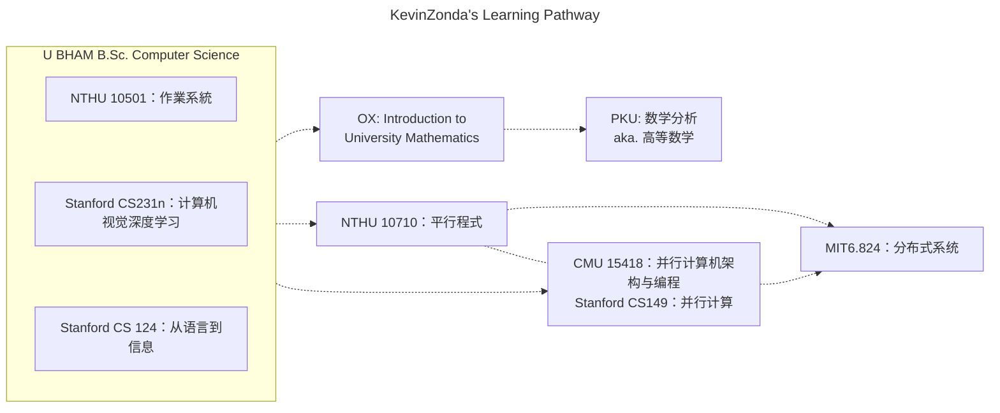

PKU 数学分析 [Bilibili](https://www.bilibili.com/video/BV1T5411P7wi/) [官网](https://resource.pku.edu.cn/index.php?r=course%2Fview&id=1083)  
OX Introduction to University Math [官网](https://courses.maths.ox.ac.uk/course/view.php?id=4938)
